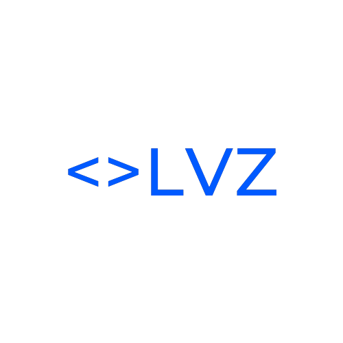
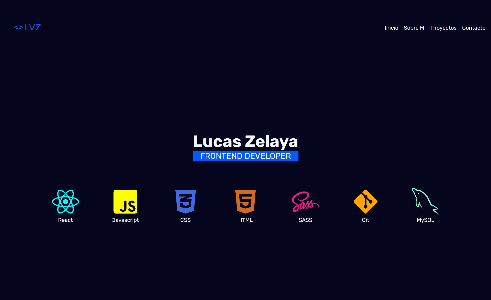

<!-- PROJECT LOGO -->
 

  

<h3 align="center">Portfolio</h3>

  

    <a href=""><strong>Explora el proyecto</strong></a>
  

<!-- Sobre el proyecto -->
## Bienvenidos a mi Portfolio :

Este es mi portfolio personal en el cual iré subiendo mis proyectos realizados a lo largo de mi carrera como desarrollador.

<!-- Tecnologias -->
### Proyecto realizado con :

* [![React][React.js]][React-url]
* [![CSS3][CSS]][CSS-url]
* [![npm][npm]][npm-url]
* [![GitHub][GitHub]][GitHub-url]
* [![VSC][VSC]][VSC-url]
<!-- CONTACT -->
## Contacto

[![linkedin][linkedin-shield]][linkedin-url]

📩 : lvcaszelaya@gmail.com

<!-- MARKDOWN LINKS & IMAGES -->
<!-- https://www.markdownguide.org/basic-syntax/#reference-style-links -->
[linkedin-shield]: https://img.shields.io/badge/-LinkedIn-black.svg?style=for-the-badge&logo=linkedin&colorB=555
[linkedin-url]: https://www.linkedin.com/in/lucasivanzelaya/
[GitHub]: https://img.shields.io/badge/github-%23121011.svg?style=for-the-badge&logo=github&logoColor=white
[GitHub-url]: https://github.com/
[React.js]: https://img.shields.io/badge/React-20232A?style=for-the-badge&logo=react&logoColor=61DAFB
[React-url]: https://reactjs.org/
[npm]: https://img.shields.io/badge/NPM-%23000000.svg?style=for-the-badge&logo=npm&logoColor=white
[npm-url]: https://www.npmjs.com/
[VSC]: https://img.shields.io/badge/Visual_Studio_Code-0078D4?style=for-the-badge&logo=visual%20studio%20code&logoColor=white
[VSC-url]: https://code.visualstudio.com/
[CSS]: https://img.shields.io/badge/CSS3-1572B6?style=for-the-badge&logo=css3&logoColor=white
[CSS-url]: https://developer.mozilla.org/en-US/docs/Web/CSS